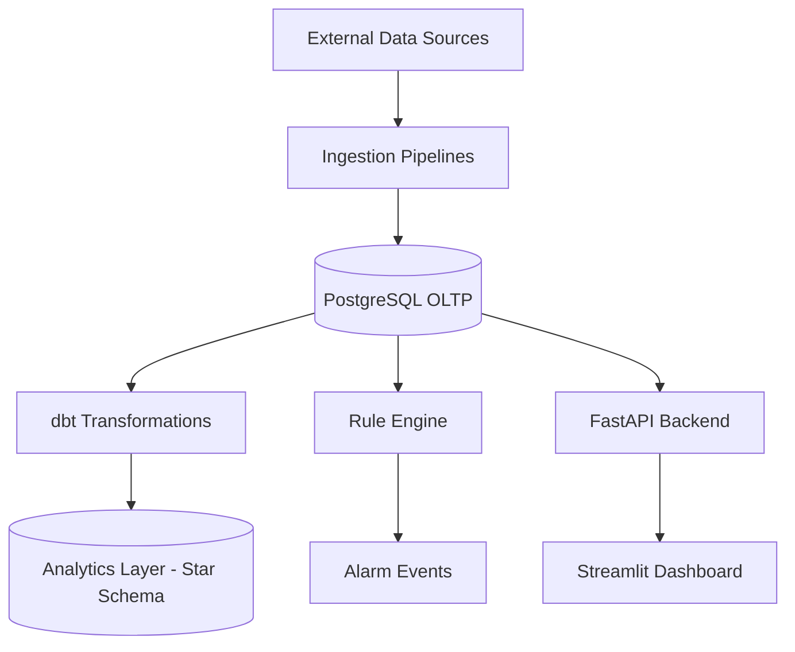
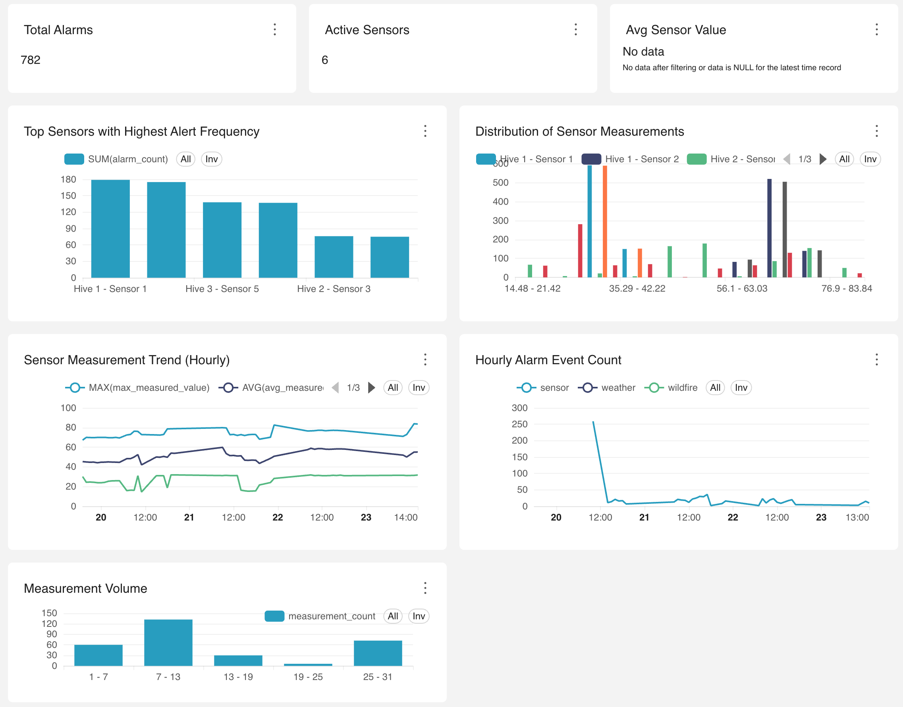

# 🐝 Beekeeper Monitor – Production-Style Data Engineering Platform 🍯

**Beekeeper Monitor** is a full-stack data engineering platform that simulates a real-world environmental monitoring system for beekeeping operations.

It integrates heterogeneous data sources (weather APIs, IoT sensor streams, wildfire datasets) and transforms them into actionable insights through a rule-based alerting engine, analytical modeling, and an interactive dashboard.

> 🎯 **Goal:** Enable proactive risk detection (e.g., overheating hives, humidity imbalance, wildfire threats)
> 💡 Designed as a **production-style data platform** with decoupled services, API-first architecture, and analytical modeling (dbt)

---

## 🚀 Live Demo

* **Streamlit App:**
  https://beekeepermonitor-demo.streamlit.app

---

## 🧪 Quick Start (Local Run)

### 1️⃣ Clone & Setup

~~~bash
git clone https://github.com/<your-username>/beekeeper-monitor.git
cd beekeeper-monitor

uv sync
~~~

---

### 2️⃣ Start Backend API

~~~bash
uv run uvicorn api.main:app --reload
~~~

API endpoints:

- API: http://localhost:8000  
- Docs: http://localhost:8000/docs  

---

### 3️⃣ Start Dashboard

~~~bash
uv run streamlit run dashboard/app.py
~~~

Open in browser:

- http://localhost:8501  

---

## 🚀 Live Data Simulation (Optional)

Run the full pipeline (sensor + weather + wildfire + rule engine):

~~~bash
bash run_live_demo.sh
~~~

This will start:

- Sensor data simulator  
- Weather ingestion pipeline (loop)  
- Wildfire ingestion pipeline (loop)  
- Rule engine  

---

## ⚙️ Manual Pipeline Execution (Optional)

~~~bash
uv run python ingestion/weather/pipeline.py
uv run python ingestion/wildfire/pipeline.py
uv run python ingestion/sensor/simulator.py
~~~

---

## 📌 Notes

- Make sure your `.env` file is configured with `DATABASE_URL`  
- If using a cloud API, update `API_BASE_URL`  
- `run_live_demo.sh` runs multiple background jobs  


 

---

## 🧱 Architecture Overview



---

## ☁️ Cloud Architecture

```text
Streamlit Cloud (Frontend)
        ↓
Render (FastAPI Backend API)
        ↓
Neon (PostgreSQL - OLTP + Analytics Storage)
```

### Key Design Decisions

* Frontend does **not** connect directly to the database
* All data access goes through a **REST API layer**
* Backend and frontend are **independently deployable**
* Environment variables are used for configuration (`API_BASE_URL`)

---

## 🔄 End-to-End Data Flow

1. **Data Ingestion**

   * External APIs (SMHI, NASA FIRMS)
   * Simulated IoT sensor data
   * Stored in PostgreSQL (OLTP layer)

2. **Processing**

   * Rule engine evaluates incoming data
   * Generates alarm events when thresholds are exceeded

3. **Transformation**

   * dbt models transform OLTP → Star Schema (OLAP)
   * Snapshots track historical changes (SCD Type 2)

4. **Serving Layer**

   * FastAPI exposes REST endpoints
   * Streamlit consumes API for visualization

---

## 🧠 Key Features

### 🔄 Multi-source ingestion

* Weather forecasts (SMHI API)
* Hive sensor measurements (simulated IoT data)
* Wildfire risk data

### ⚙️ Automated pipelines

* Python-based ingestion jobs
* Scheduled data collection
* Job tracking & monitoring

### 🚨 Rule-based alert engine

* Configurable thresholds (temperature, humidity, wildfire)
* Real-time anomaly detection
* Alarm event generation

### 📊 SQL-first analytics

* SQL views for operational queries
* dbt transformation layer
* Star schema for analytical workloads

### 🖥️ Interactive dashboard

* Built with Streamlit
* Real-time + historical monitoring
* Hierarchical filtering:

  * location → apiary → hive → sensor

---

## 🗄️ Data Platform Design

### OLTP Layer (PostgreSQL)

Stores:

* Sensor measurements (time-series)
* Weather & wildfire data
* Alarm rules & events
* Metadata (location, apiary, hive)

---

### 📊 OLAP Layer (dbt – Star Schema)

#### Fact Tables

* `fact_sensor_measurements`
* `fact_alarm_events`

#### Dimension Tables

* `dim_sensor`
* `dim_hive`
* `dim_apiary`
* `dim_date`
* `dim_time`
* `dim_metric_type`
* `dim_alarm_rule`
* `dim_severity`
* `dim_user`

---

## 📊 Analytical Dashboard (Superset)

Superset is used for analytical validation and exploration of the dbt-transformed data models, connecting directly to the Neon PostgreSQL `analytics_marts` schema.

### Key Dashboard Components

* **KPI Cards:** Total Alarms, Active Sensors, Average Sensor Value
* **Time-series Charts:** Sensor measurement trends, Alarm event timelines
* **Distribution Charts:** Sensor value distributions, Measurement volume analysis
* **Ranking:** Top sensors by alert frequency

### Architecture

```
dbt → Superset → analytics_marts
```



---

### 🕒 Slowly Changing Dimensions (SCD)

Implemented via dbt snapshots:

* `sn_sensor`
* `sn_hive`
* `sn_apiary`
* `sn_user`

Supports:

* Historical tracking
* `valid_from`, `valid_to`, `is_current`

---

## ⚙️ Rule Engine Design

The rule engine evaluates incoming data against thresholds:

* Temperature
* Humidity
* Wildfire severity

### Output

* Alarm events
* Context-aware metadata (sensor, hive, location)

---

## 🌐 API Layer (FastAPI)

### Example Endpoints

* `/api/monitoring/sensors/latest`
* `/api/monitoring/sensors/history`

### Why API-first?

* Decouples frontend & database
* Improves security
* Enables multi-client access (BI tools, dashboards, services)

---

## 🖥️ Dashboard (Streamlit)

Features:

* Real-time monitoring
* Historical trends
* Alert inspection
* Multi-level filtering

---

## 🛠️ Tech Stack

### Data Engineering

* Python
* PostgreSQL
* SQL
* dbt

### Backend

* FastAPI
* REST API
* psycopg2

### Frontend

* Streamlit

### Cloud

* Streamlit Cloud
* Render
* Neon (serverless PostgreSQL)

---

## 📦 Repository Structure

```
ingestion/        # Data ingestion pipelines
rule_engine/      # Alert evaluation logic
api/              # FastAPI backend
dashboard/        # Streamlit frontend
beekeeper_dbt/    # dbt models & snapshots
db/               # SQL schemas & views
notification/     # Alert delivery logic
```

---

## ⚖️ Design Trade-offs

### Why REST API instead of direct DB access?

* ✔ Better security (no DB exposure)
* ✔ Clear separation of concerns
* ✔ Easier scaling (multiple clients)

---

### Why OLTP + dbt instead of separate data warehouse?

* ✔ Simpler architecture for a small system
* ✔ Lower cost (Neon serverless)
* ✔ dbt provides analytical layer without extra infra

---

### Why Streamlit instead of BI tools?

* ✔ Full control over UI
* ✔ Easy integration with Python
* ✔ Fast iteration for prototypes

---

## 📈 Scalability & Future Improvements

* Introduce **Kafka** for streaming ingestion
* Add **real-time processing (Spark / Flink)**
* Connect dashboard directly to **dbt marts**
* Add **role-based access control (RBAC)**
* Integrate **ML-based anomaly detection**

---

## 🎯 What This Project Demonstrates

* End-to-end data platform design
* OLTP → OLAP transformation (dbt)
* API-first architecture
* Real-time + analytical workloads
* Data modeling (Star Schema + SCD)
* Production-style system thinking

---
